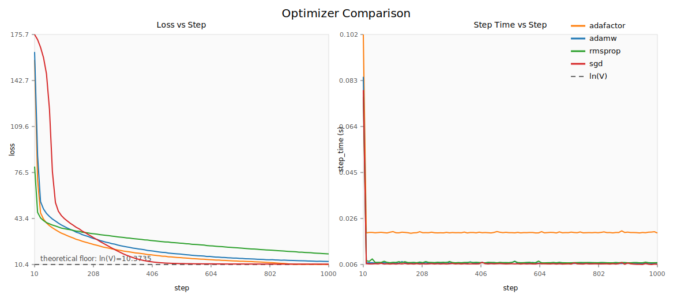
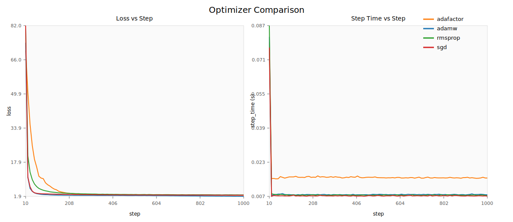
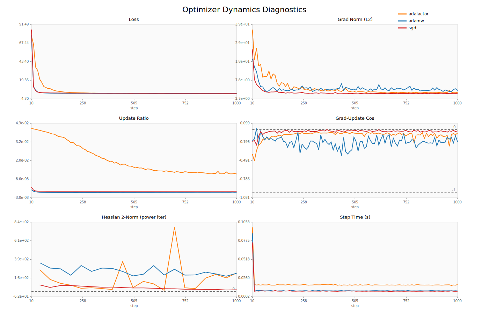

## 项目目标

本项目在可控条件下研究不同优化器在小型 Transformer 上的训练行为差异。

核心问题：

1. 优化器在合成任务上的表现有何差异？
2. 优化器在小规模真实文本语言建模任务上的表现有何差异？
3. 从非凸优化动力学视角看，优化器的轨迹几何和收敛机制有何差异？

---

## 实验设置

### 模型

- 小型 Decoder-only Transformer（约 1.68M 参数）

### 对比优化器

- AdamW
- SGD（带 momentum）
- RMSprop（及其变体）
- Adafactor

### 控制变量

- 相同模型结构
- 相同数据集（每个实验内）
- 相同 batch size
- 相同步数
- 相同初始化

### 调节变量

- 学习率（按任务和优化器分别调参）

### 设备一致性说明

- 2026-03-30 对真实文本实验日志做了一次一致性审计。
- 发现早期结果中存在 CPU / GPU 混用以及 `fixed_1000` 目录残留旧日志的问题。
- 当前 README 中的真实文本结果已全部在同一张 GPU（RTX 3090）上重跑，并覆盖错误结果。

---

## 实验一：合成任务（Synthetic）

### 任务定义

- 随机 token 序列
- 下一 token 预测：`y = roll(x)`

### 关键性质

- 真实数据分布近似均匀
- 理论下界：`loss = ln(vocab_size)`

### 观察

- 各优化器都能收敛到接近理论下界
- 优化器间差异较小
- RMSprop / SGD 在部分设置下可略优于 AdamW

### 解释

该任务简单、条件较好，大多数合理优化器都能到达近似相同最优区域。

**代表性结果图（合成任务）**

---

## 实验二：真实文本任务（Harry Potter，约 2 万字符）

### 任务定义

- 字符级下一 token 预测

### 相比合成任务的差异

- token 分布非均匀
- 存在明显局部结构（单词、标点、短语模式）
- 梯度统计更复杂

### 结果（1000 steps，调好学习率，3 seeds，统一 GPU）

| optimizer | final_loss_mean | final_loss_std | avg_step_time |
|---|---:|---:|---:|
| **AdamW** | **1.862** | 0.029 | 0.0089 |
| Adafactor | 2.354 | 0.037 | 0.0167 |
| SGD | 2.434 | 0.024 | **0.0083** |
| RMSprop | 2.561 | 0.057 | 0.0087 |

说明：

- 单 seed 下在 300-step 与 1000-step 之间出现的排名波动，在多 seed 平均后明显减弱。
- 该真实文本设置下的稳定排名为：**AdamW > Adafactor > SGD > RMSprop**。
- 在统一 GPU 后，AdamW 与 SGD 的单步时间其实非常接近，SGD 仅略快；此前“AdamW 明显更快”的现象来自设备混用，不再成立。

**代表性结果图（真实文本，多 seed 汇总）**

---

## 实验三：非凸优化动力学分析（首轮已完成）

### 分析目标

- 不仅比较“最终 loss”，还比较训练轨迹在非凸损失面的动力学行为。

### 记录指标

- `loss`
- `grad_norm_l2`
- `update_norm_l2`
- `update_ratio = update_norm_l2 / param_norm_l2`
- `grad_update_cos`（更新方向与原始梯度方向的一致性）
- `hessian_top_eig`（Hessian 最大特征值的近似）

### 首轮结果（单 seed，1000 steps，log_every=10，统一 GPU）

| optimizer | loss@10 | loss@100 | final_loss | grad_norm: first->last | update_ratio(均值) | grad_update_cos(均值) | hessian_top_eig: first->last |
|---|---:|---:|---:|---:|---:|---:|---:|
| AdamW | 77.392 | 2.618 | **1.975** | 20.02 -> 2.01 | 2.97e-4 | -0.200 | 346.91 -> 219.94 |
| SGD (momentum=0.9) | 84.859 | 2.994 | 2.468 | 25.31 -> 0.29 | 1.05e-3 | -0.033 | 78.61 -> 19.81 |
| Adafactor | 76.852 | 8.532 | 2.383 | 36.49 -> 0.97 | 2.06e-2 | -0.092 | 263.83 -> 222.68 |

### 动力学解读

- **AdamW**：前期降 loss 最快，100 步时已到 `2.618`，最终也达到最低 loss。`grad_update_cos` 均值约 `-0.200`，说明更新方向与原始梯度仅中等一致，体现出明显的自适应预条件特征。`hessian_top_eig` 从约 `346.9` 降到 `219.9`，表明它确实离开了更高曲率区域，但并没有降到像 SGD 那样低的曲率水平。
- **SGD（含动量）**：`grad_update_cos` 远离 `-1`（均值约 `-0.032`）并非实现错误，而是因为更新方向由“历史动量 + 当前梯度 + weight decay”共同决定，而不是纯 `-g_t`；因此与“当前 batch 梯度”不必高度对齐。它的梯度范数在后期被压得最低，`hessian_top_eig` 也从 `78.6` 降到 `19.8`，局部曲率比 AdamW 更低；但最终 loss 仍停在 `2.468`，说明“更平”不等于“更优”，至少在这个任务和步数预算下，SGD 更像是进入了一个较平但较差的区域。
- **Adafactor**：`update_ratio` 均值达到 `2.06e-2`，远大于 AdamW 和 SGD，说明参数更新明显更激进；其曲率代理在训练过程中还会出现符号翻转，说明局部几何和估计都更不稳定。它前期下降不慢，但 100 步时 loss 仍有 `8.532`，后续也没能追上 AdamW。
- **一个重要修正**：统一到 GPU 后，AdamW 与 SGD 的 `step_time` 基本在同一量级（都约 `0.009s`），Adafactor 才明显更慢（约 `0.017s`）。因此先前由混合设备造成的“AdamW 比 SGD 快很多”的结论已被撤回。

### 图表输出

- 单优化器六联图：
`results/real_text/dynamics/dynamics_sgd.svg`
`results/real_text/dynamics/dynamics_adafactor.svg`
`results/real_text/dynamics/optimizer_dynamics.svg`（AdamW）
- 三优化器合并六联图：
`results/real_text/dynamics/dynamics_adamw_sgd_adafactor.svg`

**代表性结果图（非凸动力学，三优化器合并）**

---

## 主要结论

### 1. 优化器差异具有明显任务依赖性

- 合成任务中差异较小
- 真实文本任务中差异更明显

### 2. AdamW 在当前真实文本设置中表现最佳

- 最低的最终 loss 均值
- 跨 seed 收敛更稳定

### 3. RMSprop 在简单任务可具竞争力，但在真实文本上较弱

- 仅靠按坐标缩放在该任务中不足以取得最佳结果

### 4. SGD 速度快但精度劣于 AdamW

- 单步时间仅略优于 AdamW
- 最终 loss 更高

### 5. 动力学视角补充了“为什么”

- 仅看最终指标不够，需要结合梯度规模、更新几何与曲率变化理解优化器行为。
- 在该任务中，AdamW 更快降低 loss，并在中等曲率区域取得最佳结果。
- SGD 的局部曲率虽然更低，但并没有得到更好的目标值，说明“更平坦”不是这里的充分解释。
- Adafactor 的更新最激进、步时也最长，但收益没有转化成更好的最终性能。

---

## 局限性

- 模型规模较小（约 1.68M）
- 数据规模较小（约 2 万字符）
- 当前多 seed 仅 3 次，统计置信度仍可提升
- 非凸动力学目前是单 seed 结果，仍需多 seed 统计验证
- `hessian_top_eig` 是低成本近似，尤其在 Adafactor 上会出现较强噪声和符号波动，解释时应更看趋势而非单点数值

---

## 后续工作

- 将 seed 数从 3 提升到 5+
- 延长训练步数，观察后期动力学
- 扩展到更大模型与更长序列
- 引入更真实的数据集
- 扩展动力学实验到多 seed，并给出置信区间
